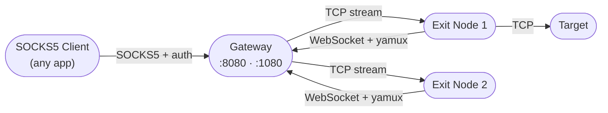

<p align="center">
  
</p>

<h1 align="center">Ambush</h1>

<p align="center">
  Self-hosted proxy network — exit nodes connect outbound, SOCKS5 clients route through them
</p>

<p align="center">
  
  
  
  
</p>

---

## What it is

Ambush is a self-hosted, protocol-agnostic TCP proxy network. Volunteer machines run the exit node binary and connect outbound to a central gateway over WebSocket. Any SOCKS5-capable client routes its traffic through the gateway, which tunnels it out through one of the connected exit nodes.

Because traffic is tunnelled as raw TCP streams, **anything that runs over TCP works** — HTTP, HTTPS, or any other protocol. The gateway and exit nodes have no awareness of what is being proxied.



## How it works

1. Exit nodes connect **outbound** to the gateway over WebSocket — no inbound ports, works from behind NAT
2. The gateway multiplexes TCP streams over each connection using [yamux](https://github.com/hashicorp/yamux)
3. SOCKS5 clients authenticate with username/password and send a `CONNECT` request
4. The router picks an exit node based on domain affinity, opens a stream, and the exit node dials the real target

## Components

| Binary | Port | Role |
|--------|------|------|
| `gateway` | `:8080` (WS), `:1080` (SOCKS5) | Accepts exit nodes, serves SOCKS5 proxy, smart routing |
| `exitnode` | — | Runs on any machine, connects to gateway, relays traffic |
| `api` | `:8081` | Admin HTTP API — manage users, tokens, credentials |

## Smart routing

The router keeps traffic looking natural to anti-bot systems:

- **Domain affinity** — same domain sticks to the same exit node for 5 min ± 20% jitter
- **Rotation** — after the window or 100 requests, the exit node rotates with a 10-minute cooldown
- **Per-user isolation** — different SOCKS5 credentials hitting the same domain use different exit nodes
- **Concurrency cap** — each exit node handles at most 10 concurrent streams
- **Automatic failover** — dead sessions are detected and retried transparently

→ [Full routing documentation](docs/routing.md)

## Security

The exit node ↔ gateway tunnel is encrypted with TLS using a self-signed CA — no public domain required. Exit nodes verify the gateway certificate against a CA cert distributed at setup time.

→ [TLS setup guide](docs/tls.md)

## Running locally

> Prerequisites: Go, Postgres (or a [Supabase](https://supabase.com) project). Run `db/schema.sql` first.

<details>
<summary><strong>Gateway</strong></summary>

```bash
# copy .env.example → .env and fill in DATABASE_URL (and TLS_CERT/TLS_KEY for production)
cp cmd/gateway/.env.example cmd/gateway/.env
./cmd/gateway/run.sh
```
</details>

<details>
<summary><strong>Exit node</strong></summary>

```bash
# first run triggers interactive setup — paste your gateway URL and token when prompted
./cmd/exitnode/run.sh
```
</details>

<details>
<summary><strong>API</strong></summary>

```bash
# copy .env.example → .env and fill in DATABASE_URL and ADMIN_TOKEN
cp cmd/api/.env.example cmd/api/.env
./cmd/api/run.sh
```
</details>

<details>
<summary><strong>Generate TLS certificates</strong></summary>

```bash
./cmd/gencerts/run.sh ./certs
# outputs: ca.crt  ca.key  gateway.crt  gateway.key
# distribute ca.crt to exit node operators — keep ca.key secret
```
</details>

## Documentation

| Doc | Contents |
|-----|----------|
| [overview.md](docs/overview.md) | System overview, components, design decisions |
| [architecture.md](docs/architecture.md) | Connection flows, internal structure, shutdown sequence |
| [routing.md](docs/routing.md) | Smart routing — affinity, rotation, cooldown, per-user isolation |
| [tls.md](docs/tls.md) | TLS setup, cert generation, renewal |
| [database.md](docs/database.md) | Schema, ER diagram, who reads/writes what |
| [api.md](docs/api.md) | Full API reference with request/response examples |
| [roadmap.md](docs/roadmap.md) | What's done, what's next |

## License

MIT — see [LICENSE](LICENSE) for details.
