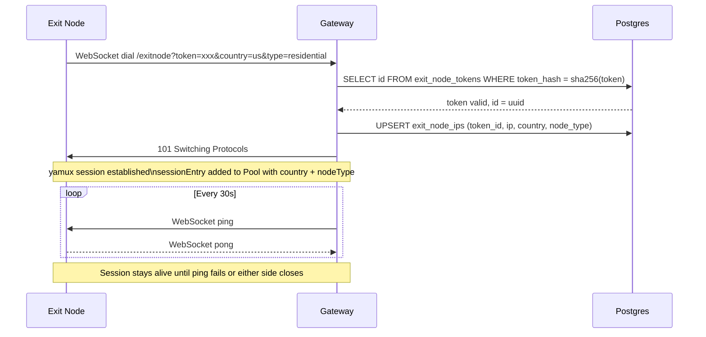
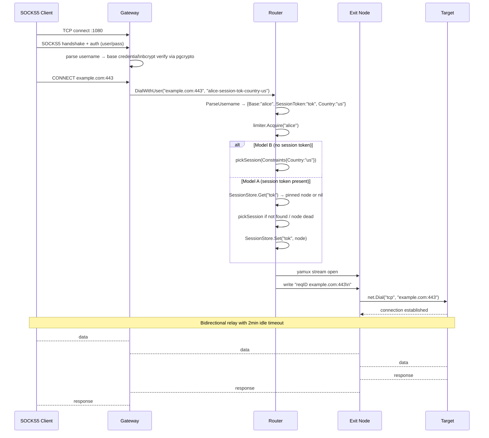
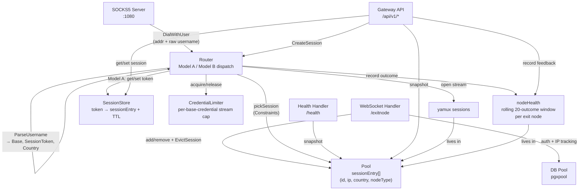
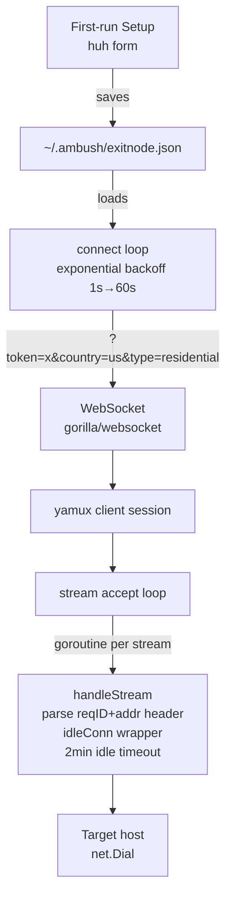
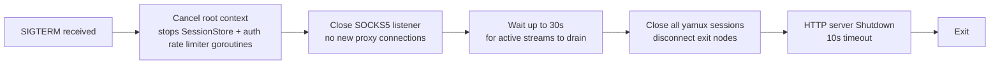

# Architecture

## Exit node connection flow

When an exit node starts, it enters a connect-retry loop with exponential backoff (1s → 60s, ×2 per failure, up to 50% jitter). On each attempt it dials the gateway's WebSocket endpoint, authenticates with its bearer token, and establishes a yamux session. The gateway is the yamux server; the exit node is the client. The gateway opens streams into the exit node — not the other way around.



## SOCKS5 request flow



## Gateway internal structure



## Exit node internal structure



## Stream header protocol

When the gateway opens a yamux stream, it writes a single header line before relaying data:

```
<req_id> <addr>\n
```

- `req_id` — 12-character random hex correlation ID, shared across all gateway log lines for this request
- `addr` — `host:port` of the target

The exit node parses this line, logs `req=<req_id> relaying to <addr>`, then dials the target. This ties gateway and exit node log lines together with a single searchable ID.

## WebSocket as net.Conn

yamux requires a `net.Conn`. gorilla WebSocket is not one — it frames messages. The `wsConn` adapter bridges this:

- **Read**: calls `conn.NextReader()` per message, drains each frame, loops to next on EOF
- **Write**: wraps each write as a single binary WebSocket message, protected by a mutex
- **ping**: uses `WriteControl` through the same mutex to avoid concurrent write panics
- **SetDeadline**: sets both read and write deadlines — yamux calls this to enforce its own keepalive and stream timeouts, so both must be applied or stalled connections leak goroutines

## Metrics

The gateway exposes Prometheus metrics at `GET /metrics` (same port as the WebSocket endpoint, default `:8080`).

| Metric | Type | Labels | Description |
|--------|------|--------|-------------|
| `ambush_exitnodes_active` | Gauge | — | Connected exit nodes |
| `ambush_streams_active` | GaugeVec | `exitnode_id` | Currently open proxy streams, per exit node |
| `ambush_dials_total` | CounterVec | `result` | Dial attempts — `success`, `error`, `rate_limited` |
| `ambush_stream_errors_total` | CounterVec | `exitnode_id` | `yamux.Open()` failures per exit node |
| `ambush_credential_limit_exceeded_total` | Counter | — | Credentials that hit `MAX_STREAMS_PER_CREDENTIAL` |

Minimal Prometheus scrape config:

```yaml
scrape_configs:
  - job_name: ambush_gateway
    static_configs:
      - targets: ['gateway:8080']
```

## Graceful shutdown sequence


