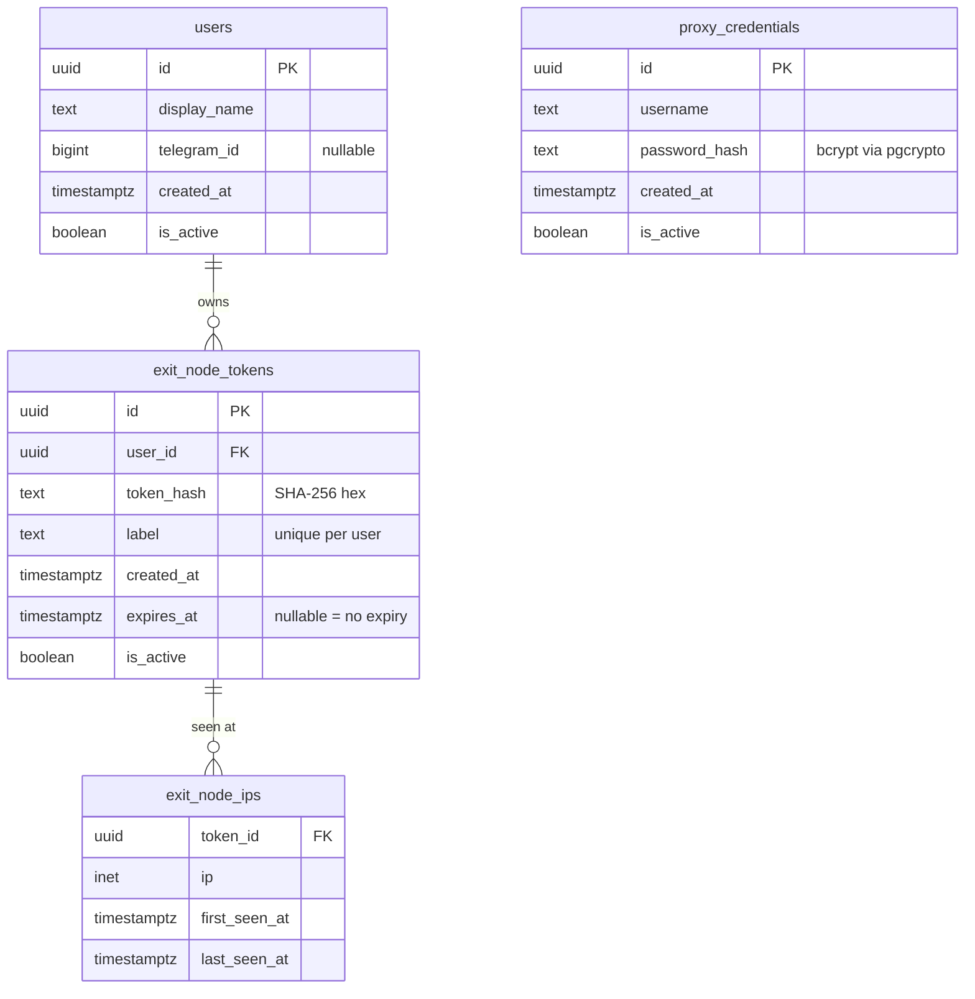

# Database

Ambush uses Postgres (hosted on Supabase). The schema is in `db/schema.sql`. Only the gateway and API binaries connect to the database.

## Entity relationship



## Tables

### `users`
Identity record for anyone who can run an exit node. The `telegram_id` column is nullable — the same table supports users registered via Telegram bot, webapp, or created directly by admin.

### `exit_node_tokens`
Bearer tokens that exit nodes use to authenticate with the gateway. One token = one exit node instance (enforced by the `UNIQUE(user_id, label)` constraint).

The raw token is returned once at creation time and never stored. The gateway stores and compares only the SHA-256 hex digest.

`expires_at IS NULL` means the token never expires.

### `exit_node_ips`
Tracks every unique public IP seen per token. Updated on each connection via upsert:

```sql
INSERT INTO exit_node_ips (token_id, ip)
VALUES ($1, $2)
ON CONFLICT (token_id, ip) DO UPDATE SET last_seen_at = now()
```

Basis for the IP diversity feature — the `user_exit_node_diversity` view aggregates unique IPs per user.

### `proxy_credentials`
SOCKS5 username/password pairs. Passwords are hashed with bcrypt via pgcrypto's `gen_salt('bf')` at write time and verified with `crypt($password, password_hash)` at auth time — the hash never leaves the database.

## Who writes what

| Table | Writer | Reader |
|-------|--------|--------|
| `users` | API | API |
| `exit_node_tokens` | API | Gateway (auth), API |
| `exit_node_ips` | Gateway | API (via view) |
| `proxy_credentials` | API | Gateway (auth), API |

## Connection pooling

The gateway uses Supabase's pgBouncer pooler URL (port 5432 transaction mode) since it holds many short-lived SOCKS5 auth queries. The API uses direct connection (port 5432) since it has infrequent, longer transactions.

## Required extension

```sql
CREATE EXTENSION IF NOT EXISTS "pgcrypto";
```

This is the first line of `db/schema.sql` and must be enabled before any other objects are created. Supabase enables it by default.
