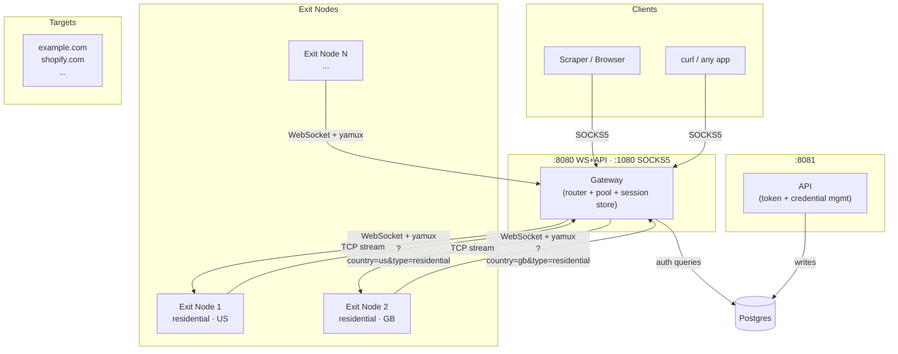

# Ambush — Overview

Ambush is a self-hosted, managed proxy network. Volunteer machines (exit nodes) connect to a central gateway over WebSocket. SOCKS5 clients route their traffic through the gateway, which tunnels it through one of the connected exit nodes to the target.

The network is protocol-agnostic — any TCP traffic can be proxied, not just HTTP/S.

## Use cases

- Distributed web scraping with residential IP diversity
- Bypassing geo-restrictions
- Multi-account management
- Any scenario requiring a pool of diverse outbound IPs

## System overview

## Components

| Component | Binary | Purpose |
|-----------|--------|---------|
| **Gateway** | `gateway` | Accepts exit node connections, serves SOCKS5 proxy, exposes gateway API |
| **Exit Node** | `exitnode` | Runs on volunteer machines, dials out to targets |
| **API** | `api` | Admin HTTP API for managing users, tokens, credentials |

## Key design decisions

- **yamux over WebSocket** — exit nodes connect outbound, no inbound port needed. Works from behind NAT and firewalls.
- **Bearer token auth** — each exit node instance has its own token, hashed with SHA-256 in the DB.
- **Model B routing (default)** — every connection gets a fresh exit node picked at random from the healthy pool. Maximises IP diversity and throughput.
- **Model A routing (opt-in)** — a session token embedded in the SOCKS5 username (`alice-session-<token>`) pins all requests to one exit node for the token's TTL. Used when the target requires session continuity (logged-in flows, stateful scrapers).
- **Geo-awareness** — exit nodes self-report country and type (`AMBUSH_COUNTRY`, `AMBUSH_TYPE`). Clients can request a specific region via the SOCKS5 username (`alice-country-us`) or pre-allocate a pinned session via the gateway API.
- **Postgres** — owns its own database for token management, credential storage, and IP diversity tracking. Exposes a clean HTTP API so any external system can integrate without touching the DB directly.
