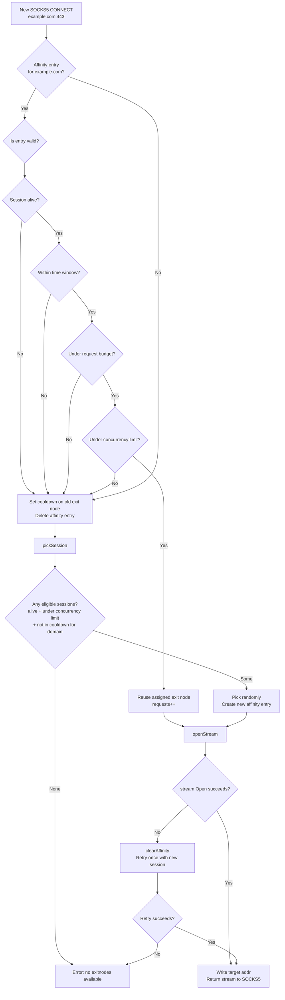

# Smart Routing

The gateway's router (`cmd/gateway/router.go`) is responsible for deciding which exit node handles each SOCKS5 connection. Random routing would cause the same domain to see many different IPs in a short window, which looks bot-like. The router implements domain affinity with time-based rotation.

## Routing decision flow

## Affinity budget

Each `(domain → exit node)` assignment has two limits. Whichever is hit first triggers rotation:

| Parameter | Default | Meaning |
|-----------|---------|---------|
| `affinityBaseWindow` | 5 minutes | Time window with ±20% jitter |
| `maxRequestsPerNode` | 100 | Max requests before rotation |
| `cooldownDuration` | 10 minutes | How long a rotated exit node is excluded from that domain |
| `maxStreamsPerNode` | 10 | Max concurrent streams per exit node |

The jitter (±20%) prevents all domains from rotating at the same time, which would cause a sudden IP change wave.

## Why this looks natural

- **Consistency**: one IP per domain per window. Cloudflare and similar see a consistent source IP making requests, not a different IP every 5 seconds.
- **Gradual transition**: when the window expires, existing connections finish on the old IP. Only new connections go to the new IP.
- **Cooldown**: the rotated exit node is excluded from that domain for 10 minutes — it doesn't immediately show up again on the same target, mimicking a user that moved on.
- **Jitter**: real users don't switch IPs on exact intervals.

## What the router does NOT own

The router controls **which IP** traffic goes through. It does not control:

- Request pacing / think time between requests (client's responsibility)
- HTTP headers, cookies, TLS fingerprint (client's responsibility)
- Whether requests look human (client's responsibility)

## Concurrency limit

Each exit node has an `activeStreams` counter (atomic int32). Sessions at `maxStreamsPerNode` are excluded from selection. This prevents a single exit node from handling dozens of simultaneous connections, which would make one residential IP look like a datacenter.

## Per-user affinity

The routing key is `username:host`, not just `host`. Each SOCKS5 credential gets its own independent affinity map entry, so two users hitting the same domain are assigned different exit nodes when possible.

This is implemented via `socks5.WithDialAndRequest` — the library passes the authenticated `*socks5.Request` to the dialer, and `request.AuthContext.Payload["Username"]` contains the verified username.

### Behaviour when exit nodes are scarce

`pickSession` picks randomly from eligible nodes (alive, under concurrency cap, not in cooldown for that domain). It has no awareness of nodes already assigned to other users for the same domain.

Consequences:

- **Each user is still consistent** — `user1:example.com` sticks to the same exit node for its full window, regardless of what other users are doing.
- **No diversity guarantee** — if there are fewer exit nodes than SOCKS5 credentials, multiple users will inevitably share an exit node. There is no error; the assignment is just random.
- **Optimal spreading is not attempted** — `pickSession` does not deprioritise nodes already assigned to another user for the same domain. With N nodes and M users (M > N), some nodes will serve multiple users.

If maximising IP diversity across users is critical, the number of active exit nodes should be kept at or above the number of concurrent SOCKS5 credentials in use.
