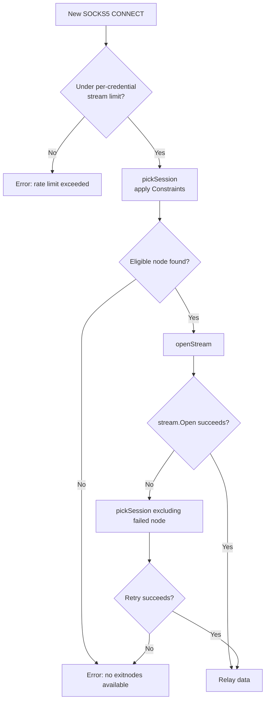
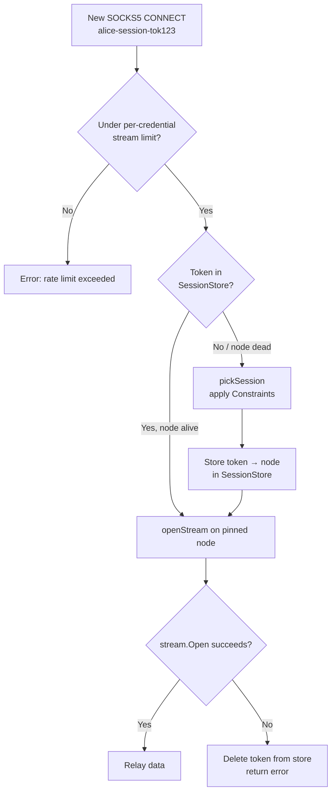

# Routing

The gateway's router (`cmd/gateway/router.go`) decides which exit node handles each SOCKS5 connection. It supports two routing models selected by the SOCKS5 username, plus geo-filtering via exit node metadata.

## SOCKS5 username format

The username carries structured options encoded as hyphen-separated key-value pairs after the base credential:

```
base[-key1-val1[-key2-val2...]]
```

Known keys:

| Key | Value | Effect |
|-----|-------|--------|
| `session` | any string | Enable Model A (sticky) routing for this token |
| `country` | ISO 3166-1 alpha-2 | Restrict selection to exit nodes in this country |

Unknown keys and their values are silently ignored. Values must not contain hyphens.

**Examples:**

| Username | Behaviour |
|----------|-----------|
| `alice` | Model B — fresh exit per connection |
| `alice-country-us` | Model B — fresh exit from US nodes only |
| `alice-session-abc123` | Model A — all requests stick to the node bound to `abc123` |
| `alice-session-abc123-country-gb` | Model A — sticky to a GB node |

The base credential (`alice`) is used for database authentication and per-credential rate limiting. Structured variants (`alice-session-tok`) share the same rate-limit slot as the bare credential.

---

## Model B — fresh exit per connection (default)

Every connection picks an exit node at random from the eligible pool. No state is kept between connections.



**Properties:**
- Maximum IP diversity — each new connection may use a different exit node
- Maximum throughput — no sticky routing means the full pool is always eligible
- One retry on stream-open failure, excluding the failed node

---

## Model A — sticky sessions (opt-in)

When the username contains a `session` key, all connections sharing that token are pinned to the same exit node for the token's TTL.



**Properties:**
- All requests with `alice-session-tok123` go through the same exit node
- If the pinned node disconnects, `EvictSession` clears the token automatically; the next request picks a fresh node and rebinds
- TTL default: 30 minutes. Configurable via `POST /api/v1/sessions`
- Session tokens are 32-character random hex strings

### Pre-allocating sessions

A scraper that wants to pre-warm sessions before a crawl run can call:

```
POST /api/v1/sessions
```

```json
{
  "ttl_seconds": 1800,
  "country": "us",
  "node_type": "residential"
}
```

Response:

```json
{
  "token": "a3f9c2d1e8b74f6a9d3e2c1b0f8a7e5d",
  "expires_at": "2026-04-20T15:30:00Z",
  "exit": {
    "id": "42",
    "ip": "1.2.3.4",
    "country": "us",
    "node_type": "residential"
  }
}
```

The scraper embeds the token in SOCKS5 usernames: `myuser-session-a3f9c2d1e8b74f6a9d3e2c1b0f8a7e5d`.

---

## Geo-filtering with Constraints

Exit nodes self-report their country and type when connecting:

```
/exitnode?token=xxx&country=us&type=residential
```

Set via environment variables on the exit node:

```bash
AMBUSH_COUNTRY=us
AMBUSH_TYPE=residential   # residential | datacenter | mobile
```

Constraints are applied in `pickSession` before the health/concurrency check. An empty constraint is unconstrained (selects from the full pool).

Both Model A and Model B honour the `country` key in the SOCKS5 username. `POST /api/v1/sessions` additionally accepts `node_type`.

---

## Health scoring

Each exit node maintains a rolling window of the last 20 stream-open outcomes. If the failure rate exceeds 50% (with at least 5 observations), the node is classified as **degraded**.

`pickSession` splits candidates into two tiers:

1. **Healthy** — selected from first; a random node is chosen from this tier
2. **Degraded** — used only when no healthy nodes are available; a warning is logged

Outcomes are recorded:
- On successful `openStream` — success
- On `yamux.Open()` failure — failure
- Via `POST /api/v1/feedback` — allows external callers (the scraper) to report target-level failures

---

## Per-node concurrency limit

Each exit node has an `activeStreams` counter. Nodes at `maxStreamsPerNode` (default 10) are excluded from `pickSession`. This prevents one residential IP from handling dozens of simultaneous connections, which looks datacenter-like.

```
maxStreamsPerNode = 10
```

---

## Per-credential rate limiting

Each SOCKS5 base credential has a cap on total concurrent open streams across all exit nodes.

| Parameter | Default | Env var |
|-----------|---------|---------|
| `MAX_STREAMS_PER_CREDENTIAL` | 20 | `MAX_STREAMS_PER_CREDENTIAL` |

When the limit is reached, new connections from that credential are rejected immediately. The slot is released when the stream closes. The limit applies per base credential — `alice` and `alice-session-tok123` share one slot pool.

---

## What the router does NOT own

The router controls **which IP** traffic goes through. It does not control:

- Request pacing / think time between requests (client's responsibility)
- HTTP headers, cookies, TLS fingerprint (client's responsibility)
- Whether requests look human (client's responsibility)
