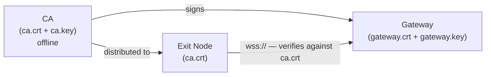

# TLS

The exit node ↔ gateway tunnel uses a self-signed CA. You generate the CA and gateway certificate once, deploy the gateway cert, and distribute the CA cert to exit node operators alongside their token. No public domain is required.

The SOCKS5 port (`:1080`) is plain TCP — this is standard for SOCKS5 clients.

## How it works



- The gateway presents `gateway.crt` (signed by your CA) on every exit node connection
- The exit node verifies the cert against `ca.crt` — it will only connect to a gateway you signed
- The CA private key (`ca.key`) never leaves the machine where you generated it
- The gateway cert CN is fixed as `ambush-gateway` — exit nodes verify this name, so the cert works regardless of the gateway's actual IP or hostname

## Initial setup

**1. Generate certificates**

Run `gencerts` once on any machine (ideally offline or the gateway machine itself):

```bash
./cmd/gencerts/run.sh [output-dir]
```

This outputs four files:

| File | Keep secret? | Purpose |
|------|-------------|---------|
| `ca.crt` | No — distribute freely | Exit nodes use this to verify the gateway |
| `ca.key` | **Yes** | Signs gateway certificates — keep offline |
| `gateway.crt` | No | Gateway's TLS certificate |
| `gateway.key` | **Yes** | Gateway's TLS private key |

**2. Configure the gateway**

Set in `cmd/gateway/.env`:

```bash
TLS_CERT=./gateway.crt
TLS_KEY=./gateway.key
```

The gateway automatically switches to `ListenAndServeTLS` when both are set. If either is missing it falls back to plain HTTP (development only).

**3. Configure exit nodes**

Exit node operators need two things: their bearer token and `ca.crt`.

Place `ca.crt` at `~/.ambush/ca.crt` (the default path), then run setup and enter a `wss://` gateway URL:

```
Gateway URL: wss://your-gateway-ip-or-host:8080
Token: <paste token>
CA Cert Path: /home/user/.ambush/ca.crt
```

The exit node reads the CA cert at startup and uses it to verify the gateway on every connection attempt, including reconnects.

## Renewing the gateway certificate

The gateway cert is valid for 2 years. To renew:

1. Run `gencerts` again with the same CA key:
   ```bash
   # only re-sign the gateway cert — keep the existing ca.key
   ./cmd/gencerts/run.sh
   ```
2. Replace `gateway.crt` and `gateway.key` on the gateway machine
3. Restart the gateway

Exit node operators do **not** need to update anything — `ca.crt` stays the same.

## Docker / CI

Pass the CA cert as an environment variable instead of a file:

```bash
AMBUSH_CA_CERT="$(cat ca.crt)" ./exitnode
```

The exit node checks `AMBUSH_CA_CERT` first and falls back to `CACertPath` from the config file.

## What happens without TLS

If `TLS_CERT` / `TLS_KEY` are not set on the gateway, it serves plain HTTP and exit nodes connect with `ws://`. Traffic between the exit node and gateway is unencrypted.

**Do not run without TLS in production.** An attacker on the network path between an exit node and the gateway can read all proxied traffic.
